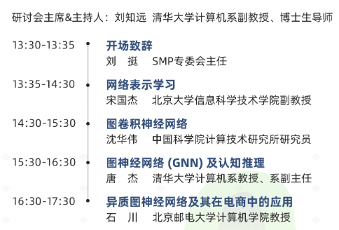

## 3.29 SMP图神经网络在线研讨会总结报告
总结报告的内容框架：
1. 会议日程
2. 宋国杰老师的报告总结
3. 沈华伟老师的报告总结
4. 唐杰老师的报告总结
5. 石川老师的报告总结
6. 我的收获和认识

昨天我在网上听了一个关于图神经网络的在线研讨会，这个研讨会的内容非常的丰富，是这个领域研究的几个比较厉害的科学家。那么我们首先看一下会议的日程，也就是从昨天的13.30到17.30这段时间的会议内容

刘知远老师是研讨会的主席也是主持人，然后接下来每位老师分享的内容都非常的丰富有内涵，非常值得我们好好品味，接下来我就开始总结一下每一位老师的报告内容，之前就听的师兄说清华大学最NLP的刘老师的团队非常的厉害，这次虽然没有听到刘老师的报告，但是也算是见到本人了。

[宋国杰老师的报告总结](./宋国杰老师报告总结.md)

[沈华伟老师的报告总结](./沈华伟老师报告总结.md)

[唐杰老师的报告总结](./唐杰老师报告总结.md)

[石川老师的报告总结](./石川老师报告总结.md)
