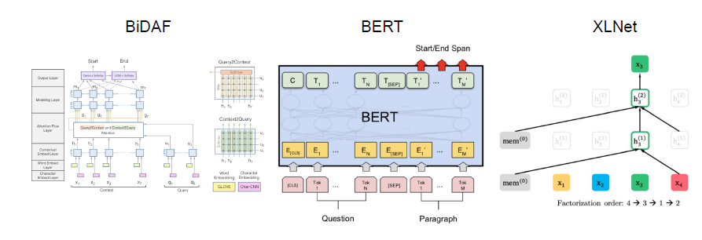
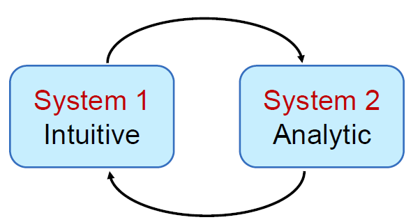
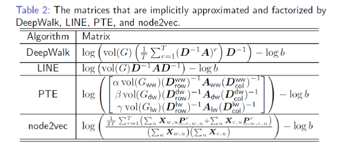

## 唐杰老师的报告总结
唐杰老师的报告非常具有框架性，从深度学习的发展到现在的GNN技术怎么演变过来的，都讲的清清楚楚，然后又扩展到了知识图谱，下一代的人工智能，提出了一个system1 和 system2 的概念。

下面看一幅非常震撼的图：

这个时间线是真的震撼，从1986年的Distributed representation就已经开始做GNN的相关研究了，一直到现在比较厉害的GCN、GAT、GraphSAGE等工作。

### 认知图谱
认知图谱是人工只能重要的一环，包括三个主要的组成部分：知识图谱，认知推理，逻辑生成。知识图谱目前已经开始实践了，认知推理和逻辑生成可能稍微复杂些。

最新的进展是：BIDAF、BERT、XLNet。目标是：理解整个文档，而不仅仅是局部片段。

### 和认知科学的结合
老师提出了 system1 和 system2相结合的思路，system1就是我们目前机器学习所作的工作，直觉的判断，更具经验进行判断，而system2需要进行逻辑的分析，然后再进行判断，这两个步骤结合到一起正是我们人类的思考方式。

### 唐老师在GNN上的一些工作

1. Network embedding as matrix factorization: unifying deepwalk, line, pte, and node2vec WSDM'18

这篇论文从理论上分析了，Deepwalk, line, pte, node2vec 这几项工作都能归结成矩阵分解的形式。

2. ProNE: Fast and Scalable Network Embedding
这项工作更多的贡献是在工作效率上，在网络表征工作上可以大大提升工作效率。

老师还透漏了正在做把GCN各种方法在理论上统一的工作，还原问题的本质。
老师还提到SVD矩阵分解有更快的算法可以使用。

