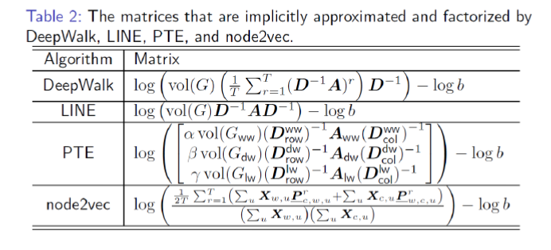

### 宋国杰老师的报告总结
宋老师是北京大学信息科学技术学院副教授，宋老师讲的主题是Network Representation Learning, 分别从三个方面介绍了网络表征学习的内容：背景知识，宋老师做的相关的工作，和未来的工作。

1. 背景知识
图数据在现实世界中有很大的应用范畴，老师举得例子里有Social Network, WWW, Information Networks, Transportation Networks, Protein Interactions, Electrical Networks.

这些例子里面呢，之前看论文或者有过相关调研的包括Social Network Transportation networks protein interactions, 社交网络是研究的比较多的了，这个领域内最开始研究的就是社交网络，然后交通网络是有好几篇动态神经网络论文提出了用RNN, LSTM,GRU 解决动态的网络的问题，所以我印象很深，蛋白质网络属于生物医学医学领域，我了解的不多，之前看过他们的论文，主要任务是判断蛋白质之间是否会产生连接(Link prediction)。

在网络分析中有哪些应用呢？
1. Node importance
2. Community detection
3. Network distance
4. Link prediction 
5. Node classification
6. Network classification

接下来老师介绍了为什么Network Embedding 最近会越来越火热呢，其中最重要的原因是真正的大数据其实是存在网络数据中的，那么为什么处理网络数据要比传统的数据要难呢？最终要的原因是节点之间的关联性，这种关联性使得网络的数据更加复杂，且导致无法很好的结构化数据，不能像图片、文本那样在欧式空间就能进行运算，所以为了解决这些问题，就出现了Network Embedding 算法，主要的思路就是把网络空间中的每一个点映射到欧式空间中的每一个点，并且要尽可能保持节点之间的近似程度的不变。

所以就兴起了网络表征的研究，老师接下来介绍了网络表征(Network Embedding)和图神经网络(GNN)两者之间的联系和区别，这里我保留自己的意见，老师是从他理解的角度上去做的，我的理解和老师的稍微有点不一样，一会我再说我自己的。老师的意思可以用下面的一幅图来描述：

我理解的这幅图的意思是，网络表征和图神经网络有交集但是也存在差异，交集就是都有深度学习相关的算法，而差异主要是网络表征的矩阵分解算法和随机游走算法。我感觉这幅图说明的意思差了点，我理解网络表征算法是一个大的领域，然后GNN是这里的其中的一个方向，这个方向只不过借助了深度学习这个工具，效果更加好了一些。

那做网络表征的方法都有哪些呢？首先是一些比较基础的表示模型

PCA是线性降维，SVD是矩阵分解算法，MDs我也不知道是啥算法，后来查了资料也是降维算法，其实矩阵分解也可以理解为降维算法。还有流形学习的LLE ISOMAP算法等。总之这类传统的方法目的就是给邻接矩阵进行降维。

其次是我们现在常见的一些网络表征算法：基于随机游走的 Deep walk, node2vec基于矩阵分解的算法。在 Network Embedding as Matrix Factorization: Unifying DeepWalk, LINE, PTE, and node2vec这篇论文里又证明了这些算法都可以归结到矩阵算法的范畴。

### 基于Spectral 的GCN
然后老师介绍了GNN的一些工作：GCN、GAT、Graph Generative Networks、Graph Spatial-temporal Networks。详细介绍了基于谱方法的GCN，这个内容之前我自己推导过，所以就不在这里介绍了，做个总结就好了，在谱域里，图的傅里叶变换可以这样表示

$$F(x) = U^Tx$$

这里面$U^T$表示的是拉普拉斯矩阵$L$ 的特征向量矩阵，而傅里叶逆变换可以这样表示

$$F^{-1}(x) = Ux$$

然后利用卷积定理，两个函数的卷积可以表示为两个函数的傅里叶变换的乘机然后再做傅里叶逆变换，所以这样卷积操作在图上就可以做了，假设$f$ $g$是图上的两个信号，那他们的卷积就是

$$f*g = U(U^Tf \odot U^Tg)$$

GCN的算法都是根据这个公式进行的改进，一开始有人用切比雪夫多项式逼近这种卷积，最终我们看到的GCN版本是切比雪夫多项式逼近的时候取了K=2，的特殊情况。

### 基于Spatial 方法的GCN
这类方法就很简单，有一个关键词叫`Aggregation`聚合，目的就是怎么把周围邻居的特征给聚合到中间节点上，又得取平均，有得取加权平局。

这类方法最大得问题是，选择邻居，怎么选择一个节点得周围邻居比较好呢？一开始学者们就思考要选择那些近似程度比较大得邻居，后来GraphSAGE就采用了随机采样得方法选择邻居，然后发现效果还可以，没有必要选择那些近似程度大得节点，因为取衡量近似程度也是一件非常重要得事情。

宋老师的一些工作：

其中第一个工作`SepNE`老师讲的非常详细，我感觉非常好，就是解决实际的问题的一个模型，先把大的网络进行分割（比如说社团检测），然后提出了`landmark`的概念，利用`landmark` 去学习节点的表征。这种方法最显著的优点是快速，要比DeepWalk 快好几个数量级。

`GraLSP` 是另外一项比较有代表性的工作，提出了匿名随机游走来获取局部的模式信息，比如说三角形、四边形等模式，这个听起来好厉害的感觉，下去好好读读这篇论文

还有一项工作是把迁移学习用在了网络表征中的，这点我还得再看看，听起来是挺好的，但是仔细想想这件事不是那么的讲得通，宋老师的其他工作也做得非常好，这里我后面要好好读一读相关得论文。

### 将来的工作
后面的工作宋老师给了三个方向的研究：1. Pretrain GNN ,就像Bert一样，可不可以Pretrain 呢？ 2. 知识驱动的GNN，这一点我不太理解。 3. 新的GNN结构，新的结构需要去探索。

