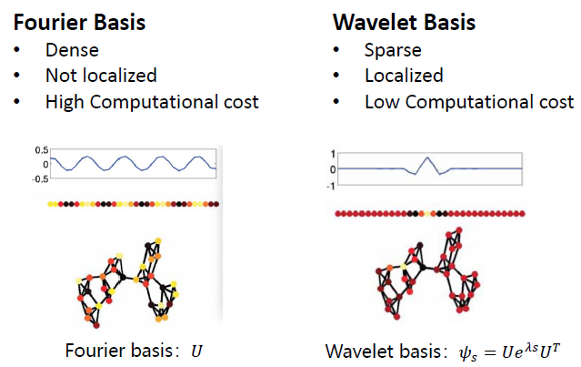
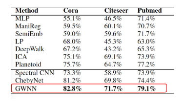
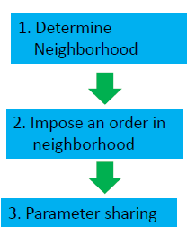
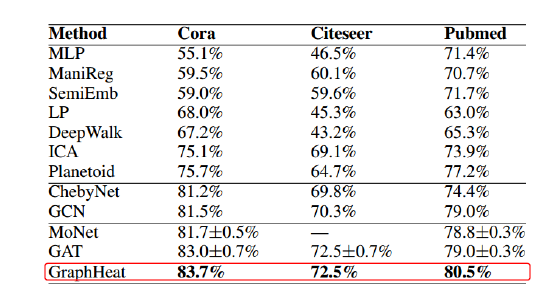

### 沈华伟老师得报告总结
先介绍一下沈老师：沈老师中科院计算机所研究员，是中科院青促会优秀会员，中国科学院院长特别奖获得者。

沈老师得报告讲得非常得通俗易懂，他主要讲的是GCN的两个分类：Spectral 和 Spatial，但是最后又总结了 Spectral 方法是Spatial 方法的一个特例，这种说法我还是第一次听说，给我的冲击还是蛮大的。 老师讲的内容，深入浅出，并且从信号处理的角度去思考给了我不一样的理解。

### Spectral 方法的GCN
沈老师同样先从CNN讲入，介绍了CNN的成功然后又引入了GCN，因为GCN的Spectral是有很好的理论基础，所以沈老师也从理论上讲了GCN是怎么做卷积的，这部分内容我们再宋老师的报告里总结过了，所以这里就掠过，但是沈老师在讲的过程中试图告诉我们GCN在数学上是怎么一回事，仔细思考一下这个算法真正有用的地方在哪里？

### Graph WaveLet NN  基于小波变换的图卷积
这个工作是沈老师的团队发表在了ICLR2019上面，可以说是非常的厉害啦，以前得GCN是在谱域上做卷积，相应得就涉及到傅里叶变换，而沈老师把这个问题放在了小波域里去解决，可以解决很多问题，那我们对比一下看看傅里叶基和小波基在图卷积中得不同：

从三个方面小波基要比傅里叶基好：1. 稠密性，傅里叶基是Dense的，而小波基是Sparse的，2. 傅里叶基是全局的，而小波基是局部的，3. 傅里叶基需要很大的运算量，小波基只需要很低的计算。并且效果有非常好的提升。

### Spatial GCN 方法
这里老师介绍了两篇论文的内容：Learning Convolutional Neural Networks for Graphs  2016ICLR 和 GraphSAGE这两篇，基于Spatial 的GCN算法可以总结为三步：第一步，找到合适的邻居，第二步，给邻居进行编序号，第三步，参数共享。

不同的Spatial方法的差异都在第一步和第二步上，参数共享一般都是类似的。

### GraphHeat 沈老师团队在2019IJCAI上的成果
核心思想是：GCN和ChebNet是根据节点周围的点确定的邻居的，而老师团队提出的GraphHeat方法根据相似性函数决定周围邻居的，这个相似性函数通过heat diffusion方式获得的。

### Graph Pooling 
接下来老师讲了Graph pooling 的技术，这个技术一开始在做局部应用的时候是没有作用的，例如Link Prediction、Node Classification。局部的任务往往是不需要Pooling操作的，但是后面又有了图分类任务，需要更加全局的信息，所以就有了Pooling的一些文章，老师把Pooling 方法大致分为了两类： Coasening 和 Node selection, 这个之前我看到很多论文的，老师总结的还是有点少。

### 讨论部分最好玩
老师在这个部分提出了好多有意思的问题，这些问题都值得我们进一步深入思考。
问题1： CNN学习了局部的稳定的特征，GNN也是嘛？
回答是：Spectral方法和Spatial方法在提取网络的结构特征上其实都是失败的，他们提取的是节点的属性信息，也就是说拓扑信息没有起到实际上的作用。

或许通过其他方法可以获取一些结构特征，比如所改进GNN的结构，或者GNN在异构的网络上就能起到提取结构特征的作用，但是这些工作都是值得我们去探索的。

### Future application 
1. 节点级别的工作：Node classification, link prediction

2. graph级别的工作：graph classification

3. 信号级别的工作：Signal classification

沈老师讲的很多内容涉及很深的原理，老师的视频后面我要多看几遍。一个字：牛！

