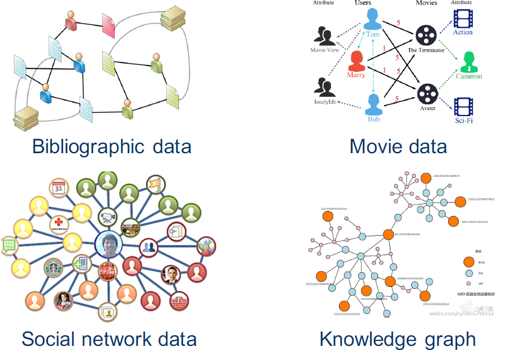
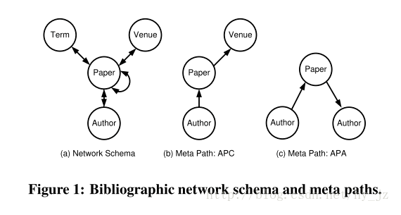
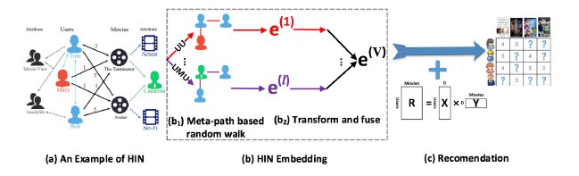
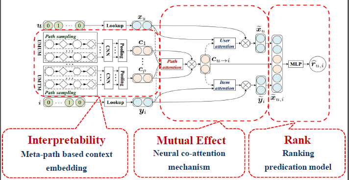
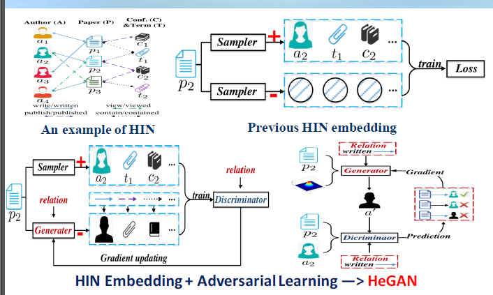

## 石川老师的报告总结
石川老师，北京邮电大学的老师，专门研究异质网络的。

### Heterogeneous Information Network

异质的信息网络和同构网络是有很大差别的，异质网络往往包含多个节点类型或者多种边的类型，比如说：Bibliographic data, movie data， Social Network data, Knowledge graph

一些基本的概念：
`Information Network` 信息网络是指一个有向图$G=(V, E)$，同时还有一个object 类型映射函数：$\Phi :V\to A$, 边的类型映射函数$\Psi : E\to R$。每一个ojbect 都有一个特定的类型， 每一条边也有特定的类型，异质网络指的是节点类型数量$|A|>1$或者边的类型数量大于1 $|R|>1$。

`Network Schema` ： Meta-level description of a network。定义为：$TG=(A, R)$是信息网络的一种meta 模板。我理解的就是不同节点类型之间存在的关系，把这些关系连起来就构成了schema。

`Meta path` A relation sequences connecting object pairs, contain rich semantics. 元路径我的理解就是不同节点之间关系的连线。

例如下图，（a）是一个schema，里面有四种节点类型和各个类型之间的关系，然后（b）（c）是两种不同的元路径，不同的元路径代表的信息是不一样的，他们之间往往存在着先后依赖关系。

### HIN的研究
1. 浅层模型
Metapath2vec

metapath2vec++

PTE

HIN2vec
上面这4篇论文是解决异质网络的表征算法开山之作。

### 老师的工作
1. HERec ： Heterogeneous Information Network Embedding for Recommendation.TKDE 2018

首先基于meta-path的随机游走，然后获得表征，最后用于推荐。

2. MCRec : Leveraging Meta-path based Context for Top-N Recommendation with A Neural Co-Attention Model. KDD 2018

3. HeGAN:Adversarial Learning on Heterogeneous Information Networks. KDD 2019
采用生成对抗网络做异构的表征，为啥我感觉有些强行做呢？需要生成吗？

这里其实我不是很明白，生成器生成的是什么特征？

### 讨论
这个领域目前做的主要是在应用场景上，需要有很好的数据，另外元路径怎么找是当前比较难解决的问题，将来比较关系的问题是：动态性，如果网络是不断变化的，那怎么解决？